The purpose of OpenFHE.jl is to make functionality from OpenFHE[^openfhe][^openfhegit] available in Julia.
The mapping is supposed to be as close as possible so that users of OpenFHE.jl can mostly rely on the OpenFHE documentation[^openfhedocs]. 
The wrapping is constructed thus:
- make a prebuilt .so of the OpenFHE C++ library[^openfhegit] available as a Julia package via a JLL[^JLL]
- map the C++ library using openfhe-julia, which uses libcxxwrap[^libcxxwrap] to define the explicit C++ → Julia mapping.
The output is a new .so that is also made available as a JLL[^JLL]
- finally, make the mappings available in native Julia with OpenFHE.jl (this package). This is made available as a regular Julia package.

This architecture and what depends on what can be seen in the carts below.

This structure has direct consequences for the release process once a new version of openfhe-development becomes available:
- make the new version of openfhe-development available as a JLL by creating a PR against Yggdrasil
- release a new version of openfhe-julia which uses the new OpenFHE_jll version. Downstream tests (OpenFHE.jl) will fail if there was a breaking change in openfhe-development.
- make the new version of openfhe-julia available as a JLL by creating a PR against Yggdrasil
- release a new version of OpenFHE.jl which uses the new openfhe_julia_jll version.
Each step has to wait for the step before to be completed, because otherwise pipelines will fail due to build errors. But everything can be built locally and created as a Draft PR.

[^openfhe]: https://openfhe.org/
[^openfhedocs]: https://openfhe-development.readthedocs.io/en/latest/
[^openfhegit]: https://github.com/openfheorg/openfhe-development
[^JLL]: JLLs are prebuilt binaries of libraries which can then used in downstream julia applications. See https://docs.binarybuilder.org/stable/jll/
Build flow Chart
[^libcxxwrap]: libcxxwrap-julia is "the C++ library component of the CxxWrap.jl package". See https://github.com/JuliaInterop/libcxxwrap-julia

```mermaid
%%{init: {"flowchart": {"defaultRenderer": "elk"}} }%%
flowchart LR
    subgraph JuliaRegistriesGeneral["`<a href='https://github.com/JuliaRegistries/General'>**JuliaRegistries/General**</a>
    `"]
    OpenFHE["`<a href='https://github.com/JuliaRegistries/General/tree/master/O/OpenFHE'>OpenFHE</a>`"]
    OpenFHE_jll["`<a href='https://github.com/JuliaRegistries/General/tree/master/jll/O/OpenFHE_jll'>OpenFHE_jll</a>`"]
    OpenFHE_int128_jll["`<a href='https://github.com/JuliaRegistries/General/tree/master/jll/O/OpenFHE_int128_jll'>OpenFHE_int128_jll</a>`"]
    openfhe_julia_jll["`<a href='https://github.com/JuliaRegistries/General/tree/master/jll/O/openfhe_julia_jll'>openfhe_julia_jll</a>`"]
    openfhe_julia_int128_jll["`<a href='https://github.com/JuliaRegistries/General/tree/master/jll/O/openfhe_julia_int128_jll'>openfhe_julia_int128_jll</a>`"]
    end
    
    subgraph JuliaBinaryWrappers
        OpenFHE_jll.jl["`<a href='https://github.com/JuliaBinaryWrappers/OpenFHE_jll.jl'>OpenFHE_jll</a>`"]
        OpenFHE_int128_jll.jl["`<a href='https://github.com/JuliaBinaryWrappers/OpenFHE_int128_jll.jl'>OpenFHE_int128_jll</a>`"]
        openfhe_julia_jll.jl["<a href='https://github.com/JuliaBinaryWrappers/openfhe_julia_jll.jl'>openfhe_julia_jll</a>"]
        openfhe_julia_int128_jll.jl["<a href='https://github.com/JuliaBinaryWrappers/openfhe_julia_int128_jll.jl'>openfhe_julia_int128_jll</a>"]
    end

    subgraph yggdrasil["`<a href="https://github.com/JuliaPackaging/Yggdrasil/tree/master">Yggdrasil</a>`"]
    ygg_OpenFHE["`<a href='https://github.com/JuliaPackaging/Yggdrasil/tree/master/O/OpenFHE'>OpenFHE</a>`"]
    ygg_OpenFHE_int128["`<a href='https://github.com/JuliaPackaging/Yggdrasil/tree/master/O/OpenFHE_int128'>OpenFHE_int128</a>`"]
    ygg_openfhe_julia["<a href='https://github.com/JuliaPackaging/Yggdrasil/tree/master/O/openfhe_julia'>openfhe_julia</a>"]
    ygg_openfhe_julia_int128["<a href='https://github.com/JuliaPackaging/Yggdrasil/tree/master/O/openfhe_julia_int128'>openfhe_julia_int128</a>"]
    end
        
    subgraph openfhe
    openfhe-development["`<a href='https://github.com/openfheorg/openfhe-development'>**openfhe-development**</a>`"]
    end
    
    subgraph hpsc-lab
    OpenFHE.jl["`
      <a href='https://github.com/hpsc-lab/OpenFHE.jl'>**OpenFHE.jl**</a> 
    `"]
    openfhe_julia["`
        <a href="https://github.com/hpsc-lab/openfhe-julia">**openfhe_julia**</a>
    `"]
    end


    OpenFHE_jll.jl -- built using <a href='https://github.com/JuliaPackaging/BinaryBuilder.jl'>BinaryBuilder</a> and <a href='https://github.com/JuliaPackaging/Yggdrasil/blob/master/O/OpenFHE/build_tarballs.jl'>build_tarballs.jl</a> from  --> ygg_OpenFHE
    OpenFHE_int128_jll.jl -- built using <a href='https://github.com/JuliaPackaging/BinaryBuilder.jl'>BinaryBuilder</a> and <a href='https://github.com/JuliaPackaging/Yggdrasil/blob/master/O/OpenFHE_int128/build_tarballs.jl'>build_tarballs.jl</a> from --> ygg_OpenFHE_int128
    openfhe_julia_jll.jl -- built using <a href='https://github.com/JuliaPackaging/BinaryBuilder.jl'>BinaryBuilder</a> and <a href='https://github.com/JuliaPackaging/Yggdrasil/blob/master/O/openfhe_julia/build_tarballs.jl'>build_tarballs.jl</a> from  --> ygg_openfhe_julia
    openfhe_julia_int128_jll.jl -- built using <a href='https://github.com/JuliaPackaging/BinaryBuilder.jl'>BinaryBuilder</a> and <a href='https://github.com/JuliaPackaging/Yggdrasil/blob/master/O/openfhe_julia_int128/build_tarballs.jl'>build_tarballs.jl</a> from  --> ygg_openfhe_julia_int128
 
    OpenFHE-- repo and uuid in <a href='https://github.com/JuliaRegistries/General/blob/master/O/OpenFHE/Package.toml'>Package.toml</a> --> OpenFHE.jl
    OpenFHE_jll -- repo and uuid in <a href='https://github.com/JuliaRegistries/General/blob/master/jll/O/OpenFHE_jll/Package.toml'>Package.toml</a> --> OpenFHE_jll.jl
    OpenFHE_int128_jll -- repo and uuid in <a href='https://github.com/JuliaRegistries/General/blob/master/jll/O/OpenFHE_int128_jll/Package.toml'>Package.toml</a> --> OpenFHE_int128_jll.jl
    openfhe_julia_jll -- repo and uuid in <a href='https://github.com/JuliaRegistries/General/blob/master/jll/O/openfhe_julia_jll/Package.toml'>Package.toml</a> --> openfhe_julia_jll.jl
    openfhe_julia_int128_jll -- repo and uuid in <a href='https://github.com/JuliaRegistries/General/blob/master/jll/O/openfhe_julia_int128_jll/Package.toml'>Package.toml</a> --> openfhe_julia_int128_jll.jl
    

    ygg_OpenFHE--"git hash in <a href='https://github.com/JuliaPackaging/Yggdrasil/blob/master/O/OpenFHE/build_tarballs.jl'>build_tarballs.jl</a><br>git url in <a href='https://github.com/JuliaPackaging/Yggdrasil/blob/master/O/OpenFHE/common.jl'>common.jl</a>"-->openfhe-development
    ygg_OpenFHE_int128--"git hash in <a href='https://github.com/JuliaPackaging/Yggdrasil/blob/master/O/OpenFHE_int128/build_tarballs.jl'>build_tarballs.jl</a><br>git url in <a href='https://github.com/JuliaPackaging/Yggdrasil/blob/master/O/OpenFHE/common.jl'>common.jl</a>"-->openfhe-development
    ygg_openfhe_julia--"git hash in <a href='https://github.com/JuliaPackaging/Yggdrasil/blob/master/O/openfhe_julia/build_tarballs.jl'>build_tarballs.jl</a><br>git url in <a href='https://github.com/JuliaPackaging/Yggdrasil/blob/master/O/openfhe_julia/common.jl'>common.jl</a>"-->openfhe_julia
    ygg_openfhe_julia_int128--"git hash in <a href='https://github.com/JuliaPackaging/Yggdrasil/blob/master/O/openfhe_julia_int128/build_tarballs.jl'>build_tarballs.jl</a><br>git url in <a href='https://github.com/JuliaPackaging/Yggdrasil/blob/master/O/openfhe_julia/common.jl'>common.jl</a>"-->openfhe_julia
    
```

Dependency flow chart

```mermaid
%%{init: {"flowchart": {"defaultRenderer": "elk"}} }%%
flowchart RL
    subgraph JuliaRegistriesGeneral["`<a href='https://github.com/JuliaRegistries/General'>**JuliaRegistries/General**</a>
    `"]
    OpenFHE["`<a href='https://github.com/JuliaRegistries/General/tree/master/O/OpenFHE'>OpenFHE</a>`"]
    OpenFHE_jll["`<a href='https://github.com/JuliaRegistries/General/tree/master/jll/O/OpenFHE_jll'>OpenFHE_jll</a>`"]
    OpenFHE_int128_jll["`<a href='https://github.com/JuliaRegistries/General/tree/master/jll/O/OpenFHE_int128_jll'>OpenFHE_int128_jll</a>`"]
    openfhe_julia_jll["`<a href='https://github.com/JuliaRegistries/General/tree/master/jll/O/openfhe_julia_jll'>openfhe_julia_jll</a>`"]
    openfhe_julia_int128_jll["`<a href='https://github.com/JuliaRegistries/General/tree/master/jll/O/openfhe_julia_int128_jll'>openfhe_julia_int128_jll</a>`"]
    end

    subgraph JuliaBinaryWrappers
        OpenFHE_jll.jl["`<a href='https://github.com/JuliaBinaryWrappers/OpenFHE_jll.jl'>OpenFHE_jll</a>`"]
        OpenFHE_int128_jll.jl["`<a href='https://github.com/JuliaBinaryWrappers/OpenFHE_int128_jll.jl'>OpenFHE_int128_jll</a>`"]
        openfhe_julia_jll.jl["<a href='https://github.com/JuliaBinaryWrappers/openfhe_julia_jll.jl'>openfhe_julia_jll</a>"]
        openfhe_julia_int128_jll.jl["<a href='https://github.com/JuliaBinaryWrappers/openfhe_julia_int128_jll.jl'>openfhe_julia_int128_jll</a>"]
    end

    subgraph yggdrasil["`<a href="https://github.com/JuliaPackaging/Yggdrasil/tree/master">Yggdrasil</a>`"]
    ygg_OpenFHE["`<a href='https://github.com/JuliaPackaging/Yggdrasil/tree/master/O/OpenFHE'>OpenFHE</a>`"]
    ygg_OpenFHE_int128["`<a href='https://github.com/JuliaPackaging/Yggdrasil/tree/master/O/OpenFHE_int128'>OpenFHE_int128</a>`"]
    ygg_openfhe_julia["<a href='https://github.com/JuliaPackaging/Yggdrasil/tree/master/O/openfhe_julia'>openfhe_julia</a>"]
    ygg_openfhe_julia_int128["<a href='https://github.com/JuliaPackaging/Yggdrasil/tree/master/O/openfhe_julia_int128'>openfhe_julia_int128</a>"]
    end
    
    subgraph openfhe
    openfhe-development["`<a href='https://github.com/openfheorg/openfhe-development'>**openfhe-development**</a>`"]
    end
    

    subgraph hpsc-lab
    OpenFHE.jl["`
      <a href='https://github.com/hpsc-lab/OpenFHE.jl'>**OpenFHE.jl**</a> 
    `"]
    openfhe_julia["`
        <a href="https://github.com/hpsc-lab/openfhe-julia">**openfhe_julia**</a>
    `"]
    end



      ygg_OpenFHE       ~~~                    OpenFHE_jll.jl
      ygg_OpenFHE_int128        ~~~                 OpenFHE_int128_jll.jl
     ygg_openfhe_julia      ~~~                   openfhe_julia_jll.jl
      ygg_openfhe_julia_int128      ~~~                   openfhe_julia_int128_jll.jl
    
    OpenFHE.jl ~~~ OpenFHE
    OpenFHE_jll.jl ~~~ OpenFHE_jll
    
     OpenFHE_int128_jll.jl      ~~~   OpenFHE_int128_jll
     openfhe_julia_jll.jl       ~~~   openfhe_julia_jll
    openfhe_julia_int128_jll.jl     ~~~   openfhe_julia_int128_jll
    openfhe-development      ~~~   ygg_OpenFHE
    openfhe-development      ~~~   ygg_OpenFHE_int128
    openfhe_julia        ~~~   ygg_openfhe_julia
    openfhe_julia        ~~~   ygg_openfhe_julia_int128



    OpenFHE.jl -. "<a href='https://github.com/hpsc-lab/OpenFHE.jl/blob/main/Project.toml'>depends on</a>" .-> openfhe_julia_jll
    OpenFHE.jl -. "<a href='https://github.com/hpsc-lab/OpenFHE.jl/blob/main/Project.toml'>depends on</a>" .-> openfhe_julia_int128_jll
    openfhe_julia_jll -. "<a href='https://github.com/JuliaRegistries/General/blob/master/jll/O/openfhe_julia_jll/Deps.toml'>depends on</a>" .-> OpenFHE_jll
    openfhe_julia_int128_jll -. "<a href='https://github.com/JuliaRegistries/General/blob/master/jll/O/openfhe_julia_int128_jll/Deps.toml'>depends on</a>" .-> OpenFHE_int128_jll
    
    
    ygg_openfhe_julia -. "<a href='https://github.com/JuliaPackaging/Yggdrasil/blob/master/O/openfhe_julia/build_tarballs.jl'> depends on</a>" .-> OpenFHE_jll
    ygg_openfhe_julia_int128 -. "<a href='https://github.com/JuliaPackaging/Yggdrasil/blob/master/O/openfhe_julia_int128/build_tarballs.jl'> depends on</a>" .-> OpenFHE_int128_jll
    
    
    OpenFHE -. "<a href='https://github.com/JuliaRegistries/General/blob/master/O/OpenFHE/Deps.toml'> depends on</a>" .-> openfhe_julia_jll
    OpenFHE -. "<a href='https://github.com/JuliaRegistries/General/blob/master/O/OpenFHE/Deps.toml'> depends on</a>" .-> openfhe_julia_int128_jll
    openfhe_julia_int128_jll.jl -. "<a href='https://github.com/JuliaBinaryWrappers/openfhe_julia_int128_jll.jl/blob/main/Project.toml'> depends on</a>" .-> OpenFHE_int128_jll.jl
    openfhe_julia_jll.jl -. "<a href='https://github.com/JuliaBinaryWrappers/openfhe_julia_jll.jl/blob/main/Project.toml'> depends on</a>" .-> OpenFHE_jll.jl

```

